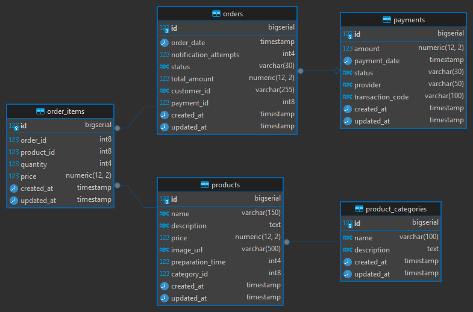

# Totem de Pedidos - Database Infrastructure


Infraestrutura de banco de dados para o sistema de **Totem de Pedidos** da FIAP (11SOAT) usando PostgreSQL na AWS RDS.

## 🤖 GitHub Actions

O projeto inclui workflows automatizados para CI/CD:

### 🔍 Terraform Validation
- **Trigger**: Push/PR em `main` ou `develop`
- **Função**: Valida sintaxe, formato e executa `terraform plan`
- **Arquivo**: `.github/workflows/terraform-validate.yml`

### 🚀 Deploy Infrastructure  
- **Trigger**: Push na `main` ou execução manual
- **Função**: Deploy automático da infraestrutura RDS
- **Arquivo**: `.github/workflows/deploy-infrastructure.yml`

### 🗄️ Database Migration
- **Trigger**: Após deploy bem-sucedido ou execução manual
- **Função**: Executa scripts de migração do banco
- **Arquivo**: `.github/workflows/database-migration.yml`

### 🔑 Configuração de Secrets
**Opção 1 (Recomendado) - GitHub OIDC:**
1. Execute primeiro deploy manual
2. Configure apenas: `AWS_GITHUB_ROLE_ARN` (obtido do output do Terraform)

**Opção 2 - Parameter Store:**
```
AWS_ACCESS_KEY_ID=sua_access_key_aqui
AWS_SECRET_ACCESS_KEY=sua_secret_key_aqui
```

**Opção 3 - Direto:**
```
AWS_ACCESS_KEY_ID=sua_access_key_aqui
AWS_SECRET_ACCESS_KEY=sua_secret_key_aqui
```

## � Como Rodar

### Pré-requisitos
- Terraform instalado
- AWS CLI configurado
- VPC existente: `infra-totem-de-pedidos-vpc`

### Deploy
```bash
# 1. Clone e configure
git clone https://github.com/FIAP-11SOAT/fase3-database-totem-de-pedidos.git
cd fase3-database-totem-de-pedidos/deployTerraform

# 2. Crie terraform.tfvars (opcional)
aws_region = "us-east-1"
project_name = "fase3-database-totem-de-pedidos"

# 3. Execute o Terraform
terraform init
terraform plan
terraform apply

# 4. Execute a migração
psql -h <rds_endpoint> -U infra_totem_de_pedidos_admin -d infra_totem_de_pedidos_database -f ../migration/NovoScript.sql
```

## 📊 Modelo de Dados

Este documento também explica a modelagem do banco de dados proposta, destacando as alterações feitas em relação ao modelo original, as melhorias de performance implementadas e a justificativa para a escolha do **PostgreSQL** como tecnologia.

### Diagrama ER
O diagrama completo do modelo de dados está disponível em: [`assets/modelo_de_dados.png`](./assets/modelo_de_dados.png)

## 📊 Modelo de Dados



### Entidades

- **Customers**: Dados dos clientes (email único, tax_id único)
- **Payments**: Registro de pagamentos com status e provider
- **Orders**: Pedidos dos clientes com status e totais
- **Product Categories**: Categorias de produtos (Lanche, Acompanhamento, Bebida, Sobremesa)
- **Products**: Catálogo de produtos com preços e tempo de preparo
- **Order Items**: Itens dos pedidos (relaciona pedidos com produtos)

## ✨ Melhorias Implementadas

### Performance
- **Índices estratégicos** em FKs e campos de busca frequente
- **BigSerial** nas PKs para suportar maior volume
- **Check constraints** para validação de dados

### Consistência
- **Unique constraints** em emails e tax_id
- **Foreign keys** com cascade/restrict apropriados
- **Valores padrão** em timestamps

### Escalabilidade
- **PostgreSQL 17.5** para recursos avançados
- **AWS RDS** para alta disponibilidade
- **Terraform** para infraestrutura reproduzível

---

*Projeto desenvolvido para FIAP 11SOAT - Pós-graduação em Software Architecture*
